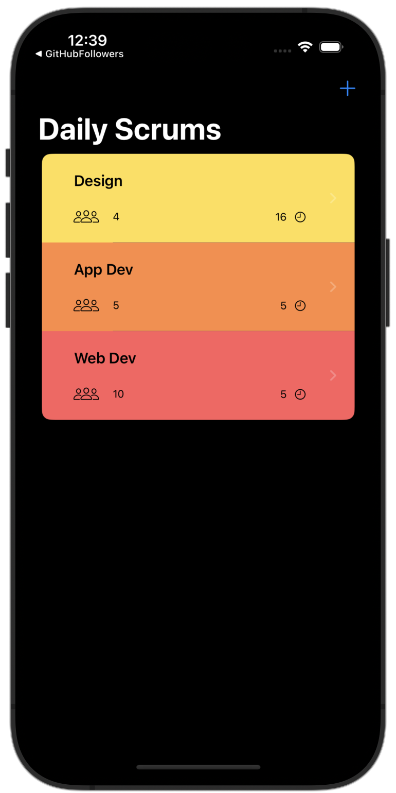
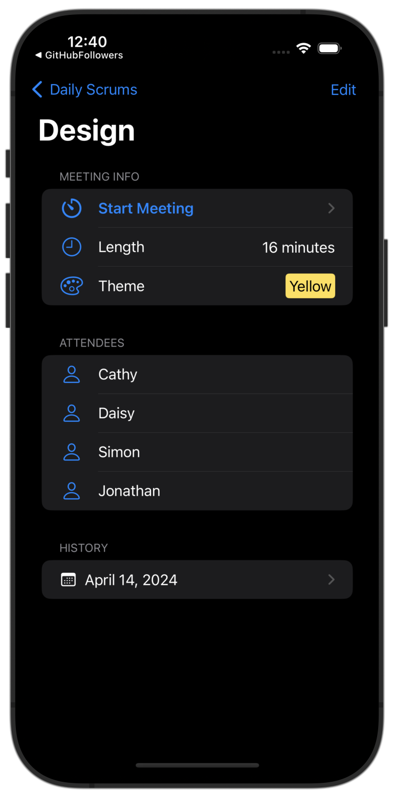
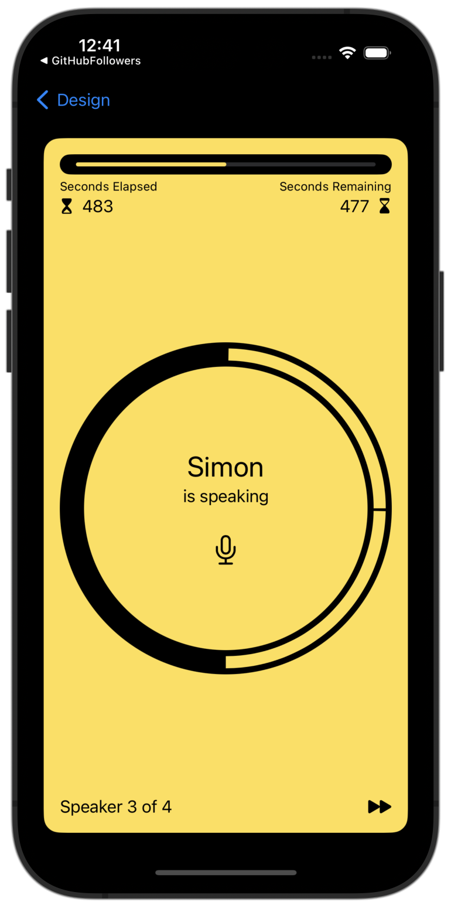
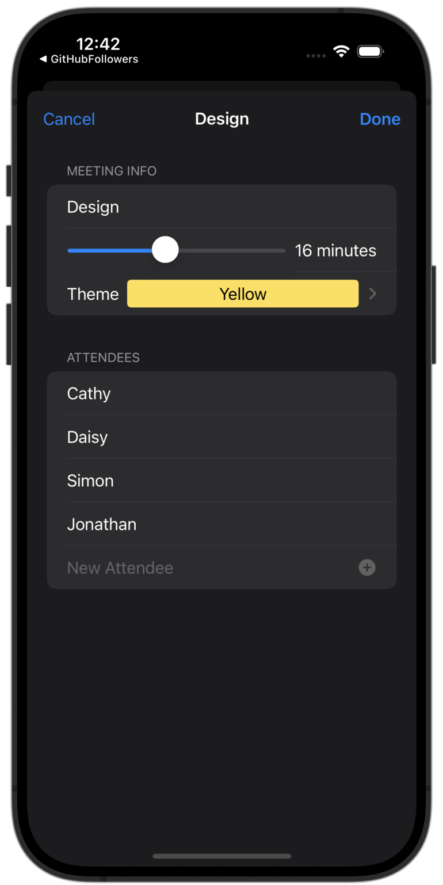
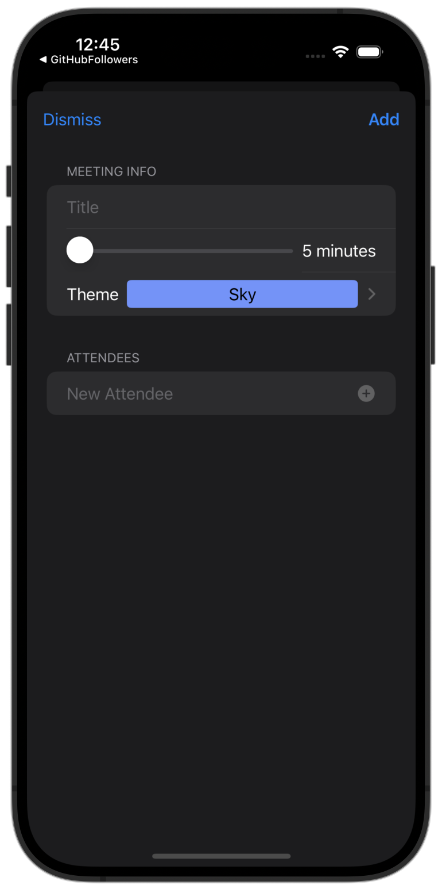
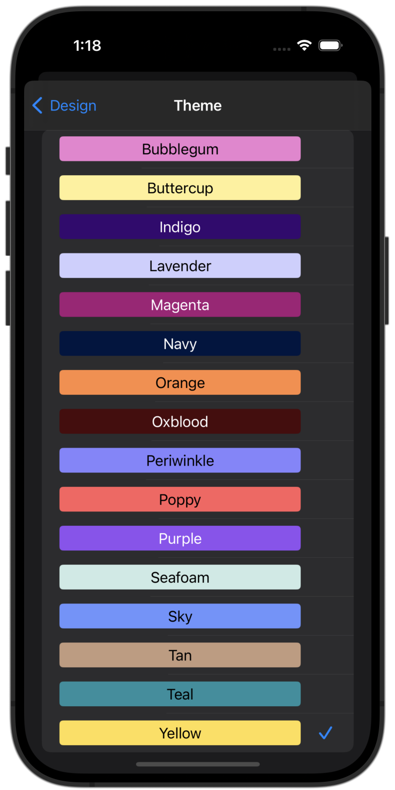
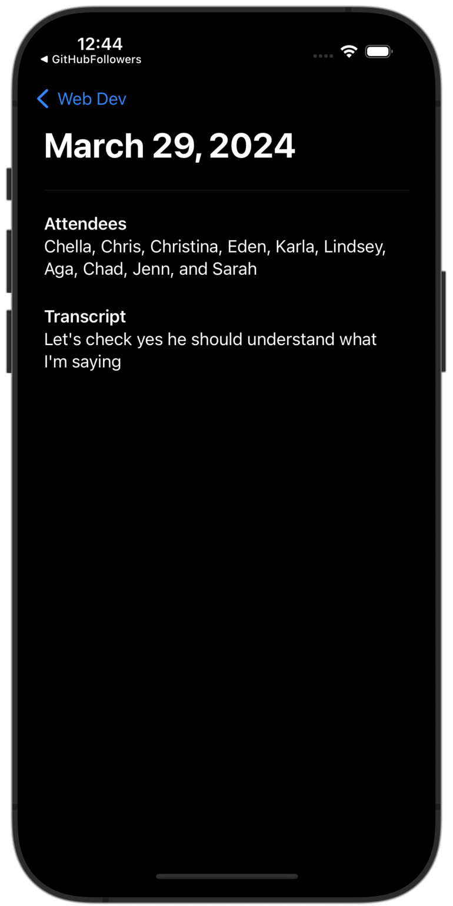

#  Scrumdinger

## Main screens
Main screen                |  Meeting info screen | Meeting in progress |
:-------------------------:|:-------------------------:|:-------------------------:|
 |  | 

## Meetings 
Edit meeting                | Add new meeting |  Choose meeting theme | Meeting history with transcription
:-------------------------:|:-------------------------:|:-------------------------:|:-------------------------:|
  |   |   |  

## User flow
 

## Features
* SwiftUI 🦄
* Custom reusable views
* AudioRecording - Contains the SpeechRecognizer class that handles the transcription of meetings.
* AVPlayer - Plays a ding sound when the meeting is over 🙃
* Extensions - Contains a few helpful extensions that are commonly used in the app.
* MockData - Contains some general mock data. In this case, there is only a simple MockError.
* Models - Contains the app's models, like DailyScrum or Theme.
* ScrumStore - Contains the logic to read from and write to the file system, where the daily scrums are stored.
* 16 different color themes
* Persistence